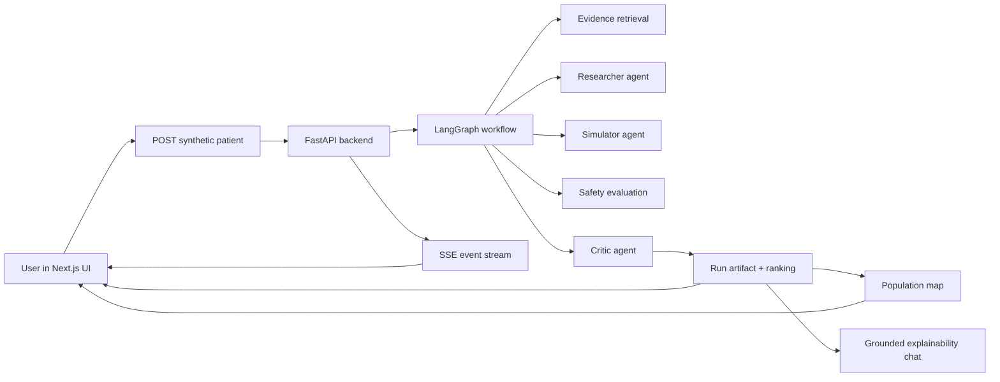
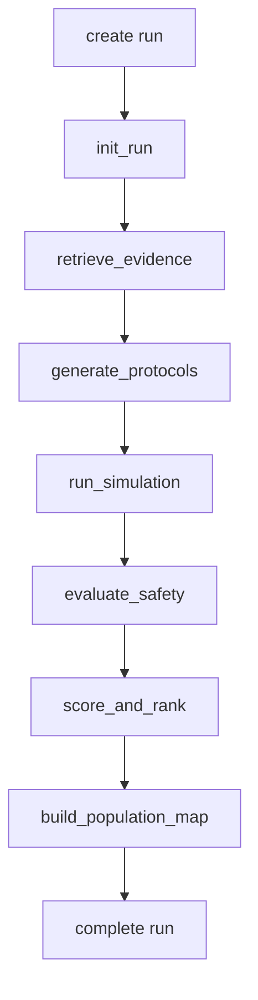
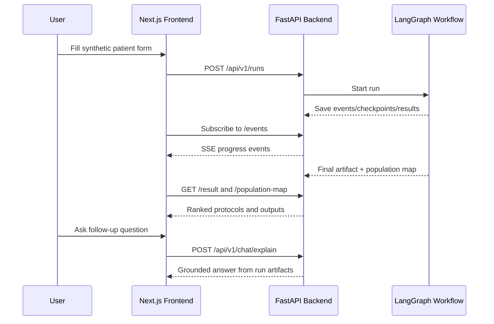
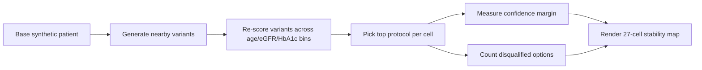

# Astra-Gemma

Astra-Gemma is a research prototype that lets you create a **synthetic Type 2 Diabetes patient**, test multiple treatment plans against that synthetic patient, and see which plans look strongest inside the simulator.

In simple terms:

- You fill in a patient profile such as age, HbA1c, kidney function, blood pressure, current meds, and comorbidities.
- The system looks up diabetes evidence and guidelines relevant to that profile.
- MedGemma helps generate several possible treatment protocols.
- The backend simulates how each protocol might behave over time.
- Safety rules remove risky options.
- A critic ranks the remaining options and explains the winner.
- The frontend shows the whole process live, including a ranking table, safety warnings, and a small "what if nearby patients looked slightly different?" map.

This is **not a clinical decision tool**. It is a simulation and explainability demo for synthetic patients only.

## What The Application Does

Think of the app as a trial sandbox for one synthetic patient at a time.

Instead of saying, "What is the one right diabetes treatment?", Astra-Gemma asks:

1. What are several reasonable protocol candidates for this patient profile?
2. Which ones appear strongest when simulated?
3. Which ones should be rejected because of safety or contraindication rules?
4. How stable is the top recommendation if the patient is a little older, has a slightly different HbA1c, or has different kidney function?

The result is a ranked list of protocols, each with:

- expected benefit signals
- safety flags
- explanation text
- evidence citations
- a final recommendation summary

## How It Works In Plain Language

The application has two big parts:

- A **frontend** where you enter a synthetic patient and watch the run live
- A **backend** where agents, simulation code, retrieval, safety checks, and ranking happen

When you press run:

1. The frontend sends the patient profile to the backend.
2. The backend creates a run ID and starts a workflow.
3. The workflow pulls evidence related to the patient.
4. MedGemma proposes multiple treatment ideas.
5. A simulator runs many fast rough trials, then does deeper simulation on the best few.
6. Safety rules inspect each protocol.
7. A critic scores and ranks the protocols.
8. A population stability map checks whether the top answer changes across nearby synthetic patient variants.
9. The frontend streams progress events as they happen.

## What You See In The UI

The app has two main screens:

- `/` - patient twin builder
- `/run/[id]` - live simulation dashboard

On the run page, the user sees:

- a live workflow timeline from SSE events
- a chart of protocol trajectories
- disqualification / black-box style safety warnings
- the final recommendation
- a ranked protocol table
- a 27-cell population stability map
- a grounded explainability chat box for asking follow-up questions about the finished run

## Simple Mental Model

If you want the shortest possible description:

> Astra-Gemma is a synthetic-patient simulation app that uses retrieved diabetes evidence, MedGemma-generated protocol ideas, simulation engines, and safety rules to rank candidate treatments and explain why one option wins.

---

## Architecture Overview

### High-Level System Diagram



### Workflow Diagram



### User Flow



## Repository Structure

```text
.
├── backend/
│   ├── app/
│   │   ├── agents/         # Researcher, simulator, critic
│   │   ├── api/            # FastAPI routes
│   │   ├── db/             # SQLite repository layer
│   │   ├── graph/          # LangGraph workflow orchestration
│   │   ├── models/         # Pydantic schemas
│   │   ├── rag/            # Evidence ingestion and retrieval
│   │   ├── safety/         # Contraindication and rule logic
│   │   ├── services/       # Settings, model runtime, population map
│   │   └── sim/            # Coarse and high-fidelity simulation
│   ├── scripts/            # Benchmarks
│   └── tests/              # Backend tests
├── frontend/
│   ├── app/                # Next.js app router pages and components
│   └── tests/e2e/          # Playwright tests
├── data/                   # Seed evidence and related assets
├── scripts/                # Bootstrap/dev/screenshot helper scripts
└── submission/             # Hackathon submission assets
```

## Core Components

### 1. Frontend

The frontend is a Next.js app using the App Router.

Main responsibilities:

- collect synthetic patient input
- start a backend run
- stream live workflow events over SSE
- render rankings, warnings, charts, and the population map
- provide a grounded Q&A panel after a run completes

Key pages:

- `frontend/app/page.tsx` - patient twin intake screen
- `frontend/app/run/[id]/page.tsx` - live run dashboard

### 2. API Layer

The backend is a FastAPI service that exposes run creation, streaming, result fetch, population map fetch, and explainability chat APIs.

Key routes:

- `POST /api/v1/runs`
- `POST /api/v1/runs/{run_id}/resume`
- `GET /api/v1/runs/{run_id}/events`
- `GET /api/v1/runs/{run_id}/result`
- `GET /api/v1/runs/{run_id}/population-map`
- `GET /api/v1/runs/{run_id}/status`
- `POST /api/v1/chat/explain`

### 3. LangGraph Workflow

The orchestration layer lives in `backend/app/graph/`.

The workflow service:

- creates run IDs
- starts async runs
- persists checkpoints after each node
- supports resume from the latest checkpoint
- can auto-resume incomplete runs on startup

The concrete node flow in the engine is:

1. initialize the run
2. retrieve evidence
3. generate protocols
4. run simulation
5. evaluate safety
6. score and rank
7. generate the population map
8. persist the final artifact

### 4. Researcher Agent

The researcher agent uses MedGemma to generate candidate protocols in JSON.

Each protocol includes:

- `protocol_id`
- `label`
- `meds`
- `lifestyle_plan`
- `rationale`
- citation source IDs

If model output is weak or incomplete, the code falls back to template protocols so the pipeline still produces a minimum protocol set.

### 5. Simulator Agent

The simulator has a two-stage structure:

- **coarse stage**: run many fast rough trials for all protocols
- **high-fidelity stage**: run deeper simulations on the shortlisted protocols

Default settings in `backend/app/services/settings.py`:

- `COARSE_TRIALS=1000`
- `SIM_HORIZON_DAYS=180`
- `HIGH_FIDELITY_COUNT=5`
- `POPULATION_MAP_TRIALS=120`

This design keeps the system fast enough for local demo use while still reserving deeper simulation for the most promising candidates.

### 6. Safety Layer

The safety layer evaluates simulated trajectories and protocol properties to catch risky or disqualifying conditions.

Examples visible in the codebase include:

- low eGFR and metformin-related contraindication checks
- low eGFR and SGLT2 risk handling
- liver stress / ALT-related risk checks
- heart-failure-related TZD contraindication logic
- severe event burden disqualification

If a protocol is disqualified, the critic can attach a prominent warning message and set its final score to zero.

### 7. Critic Agent

The critic combines:

- efficacy signal
- safety signal
- adherence signal
- robustness signal
- comorbidity-fit logic

It produces:

- per-protocol scores
- explanations
- black-box warnings for disqualified protocols
- a final recommendation summary

## Data Model

The central request object is `PatientTwinInput`.

Important fields include:

- `age`
- `sex`
- `bmi`
- `hba1c`
- `fasting_glucose`
- `systolic_bp`
- `diastolic_bp`
- `egfr`
- `alt`
- `adherence_probability`
- `comorbidities`
- `meds_current`
- `objective`

The main final response object is `RunArtifact`, which contains:

- run metadata
- the synthetic patient payload
- retrieved evidence chunks
- ranked protocol results
- the final recommendation text
- disclaimer text
- optional population map artifact

## Event Streaming

The frontend listens to server-sent events from `GET /api/v1/runs/{run_id}/events`.

Important event types include:

- `run.started`
- `run.resumed`
- `protocols.generated`
- `coarse.progress`
- `shortlist.ready`
- `highfidelity.progress`
- `critic.done`
- `population_map.ready`
- `run.completed`
- `run.failed`

This is what powers the live "simulation theater" feel of the run page.

## Population Stability Map

One distinctive feature is the population map.

After ranking the main patient, the backend creates a small grid of nearby synthetic patients across:

- age
- eGFR
- HbA1c

That gives a 27-cell neighborhood view showing:

- where the winning protocol stays the same
- where another protocol takes over
- how confident the margin is
- how many protocols were blocked by safety constraints in that cell

### Population Map Concept



## Explainability Chat

The Q&A endpoint is intentionally constrained.

It does **not** answer from general world knowledge. It answers only from the saved run artifact. The chat route:

- loads the completed run
- summarizes the top protocol results
- checks whether the user question overlaps with grounded run context
- asks MedGemma for a short answer using only that context
- returns grounded source IDs used in the answer

This keeps the explainability surface more defensible than a general-purpose chatbot.

## Storage And Persistence

The backend uses local persistence:

- **SQLite** for runs, checkpoints, events, scores, and artifacts
- **ChromaDB** for retrieval storage

Checkpointing matters because runs can be resumed. Each workflow node persists state, and the workflow service can restart from the latest checkpoint.

## MedGemma Runtime Options

The backend supports multiple runtime modes:

- `mock` - local scaffolding without a live model runtime
- `mlx` - OpenAI-compatible MLX endpoint
- `ollama` - Ollama-based runtime

Example `backend/.env` for MLX:

```bash
MEDGEMMA_RUNTIME=mlx
MEDGEMMA_MODEL=google/medgemma-27b-it
MEDGEMMA_MLX_ENDPOINT=http://127.0.0.1:8080/v1/chat/completions
```

Example `backend/.env` for Ollama:

```bash
MEDGEMMA_RUNTIME=ollama
MEDGEMMA_OLLAMA_MODEL=medgemma
MEDGEMMA_OLLAMA_URL=http://127.0.0.1:11434/api/generate
```

Example for local scaffolding:

```bash
MEDGEMMA_RUNTIME=mock
```

## Local Development

### Prerequisites

- Python `3.11+`
- Node.js / npm

### Fast Start

```bash
./scripts/bootstrap.sh
cp backend/.env.example backend/.env
make migrate
./scripts/dev.sh
```

Then open:

- Frontend: `http://localhost:3000`
- Backend health: `http://localhost:8000/health`

### Equivalent Manual Commands

Backend:

```bash
python3 -m venv .venv
source .venv/bin/activate
pip install -e backend[dev]
cd backend
alembic upgrade head
uvicorn app.main:app --reload --port 8000
```

Frontend:

```bash
cd frontend
npm install
npm run dev
```

If needed:

```bash
export NEXT_PUBLIC_API_BASE=http://localhost:8000
```

## Environment Variables

Important backend settings:

- `MEDGEMMA_RUNTIME`
- `MEDGEMMA_MODEL`
- `MEDGEMMA_MLX_ENDPOINT`
- `MEDGEMMA_TIMEOUT_SECONDS`
- `MEDGEMMA_MAX_TOKENS`
- `MEDGEMMA_OLLAMA_URL`
- `MEDGEMMA_OLLAMA_MODEL`
- `ASTRA_DB_PATH`
- `ASTRA_CHROMA_PATH`
- `SIM_HORIZON_DAYS`
- `COARSE_TRIALS`
- `HIGH_FIDELITY_COUNT`
- `POPULATION_MAP_TRIALS`
- `AUTO_RESUME_INCOMPLETE_RUNS`
- `ASTRA_FAIL_AFTER_NODE`
- `ENFORCE_ALEMBIC_HEAD`
- `CORS_ORIGINS`

## Evidence Ingestion

Seed evidence lives in:

- `data/guidelines/t2d_seed_evidence.json`
- `data/guidelines/t2d_queries.json`

To ingest and validate a larger evidence corpus:

```bash
source .venv312/bin/activate
cd backend
python -m app.rag.ingest_pubmed --seed ../data/guidelines/t2d_seed_evidence.json --query-file ../data/guidelines/t2d_queries.json --target-count 500
python -m app.rag.validate_corpus --target-count 500
```

Validation output:

- `output/evidence/evidence_report.json`

## Testing

Backend tests:

```bash
source .venv/bin/activate
cd backend
pytest
```

Frontend typecheck:

```bash
cd frontend
npm run lint
```

Frontend end-to-end tests:

```bash
cd frontend
npx playwright test
```

Deterministic screenshots:

```bash
./scripts/capture_screenshots.sh
```

## Benchmarking

```bash
source .venv312/bin/activate
cd backend
MEDGEMMA_RUNTIME=mock ENFORCE_ALEMBIC_HEAD=false python scripts/benchmark_runs.py
```

Outputs:

- `output/benchmarks/benchmark_raw.json`
- `output/benchmarks/benchmark_summary.md`

## Design Choices

Why this architecture is reasonable for a hackathon prototype:

- The frontend is thin and reactive.
- The backend owns all stateful workflow logic.
- LangGraph gives explicit node boundaries and checkpointing.
- SSE is simpler than WebSockets for one-way progress streaming.
- The simulator uses a staged approach so local execution stays practical.
- The explainability chat is grounded to run artifacts instead of broad open-ended generation.
- Mock runtime support makes the project usable even without a full model stack.

## Current Boundaries

This project is intentionally narrow.

It does not:

- operate on real patients
- provide medical advice
- replace guideline review or clinician judgment
- claim external clinical validity from the simulator alone
- guarantee that generated protocol ideas are safe until the safety layer evaluates them

## Safety Disclaimer

Astra-Gemma is a research prototype for simulation and education only.
It does not provide medical advice, diagnosis, or treatment recommendations.

Use synthetic profiles only.
